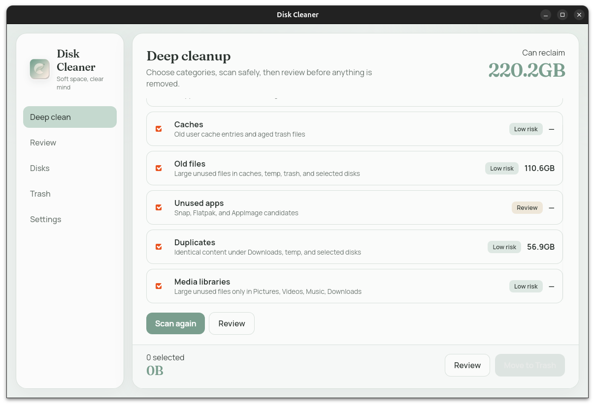

# 🧹 Disk Cleaner

<p align="center">
  
</p>

> **In short:** a safe Ubuntu / Linux disk cleaner.  
> Finds reclaimable space (Docker, caches, old files, apps, dupes, media) → **you review → then clean**.  
> GUI defaults to **Trash**, not permanent delete. CLI included.

Ubuntu / Linux disk cleaner with a pastel desktop GUI and a matching CLI.

**Keywords:** Ubuntu disk cleaner · free disk space Linux · Docker prune GUI · duplicate file finder · trash restore · Flatpak / Snap cleanup

---

## ⚡ Install

**One command** (Linux x86_64):

```bash
curl -fsSL https://raw.githubusercontent.com/sevocrear/disk-cleaner/main/install.sh | bash
```

Installs both tools into `~/.local`:

| Command | What it is |
| --- | --- |
| `disk-cleaner` | CLI (dry-run by default) |
| `disk-cleaner-app` | Desktop GUI (also in the Apps menu as **Disk Cleaner**) |

Uninstall:

```bash
disk-cleaner-uninstall
# or:
curl -fsSL https://raw.githubusercontent.com/sevocrear/disk-cleaner/main/scripts/uninstall.sh | bash
```

### 📦 Requirements

- **CLI:** no extra packages
- **GUI runtime (Ubuntu/Debian):** `libwebkit2gtk-4.1-0` (usually already present on desktop installs)

```bash
sudo apt install libwebkit2gtk-4.1-0
```

Ensure `~/.local/bin` is on your `PATH`.

---

## 🚀 Quick start

```bash
# Scan only (safe)
disk-cleaner

# Apply permanently (CLI deletes for real; confirm large jobs with --yes)
disk-cleaner --apply --yes

# Parallel delete workers (default: CPU count, clamped 2–8)
disk-cleaner --apply --yes --jobs 8

# Browse disk usage like ncdu: arrows to move, Enter to open, Space to mark, d to delete
disk-cleaner browse ~

# Docker images by last use + build cache age (threshold in days)
disk-cleaner docker --docker-unused-days 30

# Optional: record every container start so "last used" survives `docker run --rm`
disk-cleaner docker-track --install

# Open the GUI — select items, clean to Trash by default
disk-cleaner-app
```

---

## ✨ What it cleans

| Phase | Examples |
| --- | --- |
| 🐳 Docker | images unused for N days (by **last use**, not build date), stopped containers, build cache unused for N days |
| 🗂️ Caches | user caches, optional package-manager caches |
| 📄 Files | old large files under home / extras |
| 📦 Apps | idle Snap / Flatpak / AppImage / optional `/opt` |
| 🔁 Dupes | content-identical files above a size floor |
| 🎬 Media | large items under Pictures, Videos, Music, Downloads |

GUI panels: **Deep clean** · **Review** · **Overview** · **Docker** · **Disks** · **Trash** · **Settings**.  
After a clean you get a short report (files removed, space freed).

### 🔎 Overview (ncdu-style)

Scan any folder or disk once, then browse it instantly: folders sorted by size with
share bars, breadcrumbs, keyboard navigation (↑↓ · Enter · Backspace · Space · Delete),
and delete selected items to Trash or permanently. Sizes are real disk usage (sparse files,
hard links counted once).

- **Invisible space:** when you scan a whole disk, it explains what `df` counts but a user
  can't see — Docker data in `/var/lib/docker`, deleted files still held open by a process,
  other root-only folders.
- **In-use check:** before deleting, it lists running programs that use the path
  (open files, working dir, mapped libraries) — e.g. a tool running from `~/.cache/uv`.
- The same browser runs in the terminal: `disk-cleaner browse [PATH]`.

### 🐳 Docker by last use

Docker does not store when an image was last run, so Disk Cleaner derives it from
containers (created / started / finished), the pull/tag time, and the build time.
Build cache uses BuildKit's own last-used time (`docker builder prune --filter until=…`).
For exact history, enable the usage tracker (GUI Docker tab or
`disk-cleaner docker-track --install`): a small systemd user service that records
container starts from `docker events`.

---

## 🛡️ Safety

- Deep clean does not walk all of `/`
- Hard deny list for system prefixes (`/usr`, `/etc`, …); Overview never deletes them,
  your home folder (or its parents), or mount points
- Overview warns before deleting paths that running programs use
- Docker images that still have a container (running or stopped) are never removed
- Protect globs for SSH keys, browsers, Hugging Face caches (HF opt-in)
- GUI defaults to **move to Trash**; permanent delete is a setting
- CLI `--apply` deletes permanently (same model as classic host cleaners)

Config lives at `~/.config/disk-cleaner/config.toml`.

---

## 🔧 Build from source

Need: Rust stable, Node.js 18+, and on Linux the WebKitGTK 4.1 **dev** packages for the GUI:

```bash
sudo apt install build-essential curl \
  libwebkit2gtk-4.1-dev libayatana-appindicator3-dev librsvg2-dev patchelf
```

```bash
git clone https://github.com/sevocrear/disk-cleaner.git
cd disk-cleaner
./scripts/package-linux.sh   # builds UI + binaries, writes dist/*.tar.gz
DISK_CLEANER_TARBALL=./dist/disk-cleaner-linux-x86_64.tar.gz ./install.sh
```

Dev loop:

```bash
cargo build --release -p disk-cleaner-cli
cd ui && npm install && npm run build && cd ..
cargo run --release -p disk-cleaner-app
```

---

## 🧪 CI

GitHub Actions runs on every push and pull request to `main`:

- `cargo test` (engine + CLI, including TUI render tests) + `cargo check --workspace`
- UI `npm ci && npm run build` (TypeScript + Vite), `npm test` (Vitest + Testing Library)
- UI end-to-end: `npm run test:e2e` (Playwright, Chromium, against the built UI with mocks)

Block a bad push locally (optional):

```bash
ln -sf ../../scripts/pre-push .git/hooks/pre-push
```

---

## 📁 Project layout

```
crates/disk-cleaner-engine/   shared scan / trash / disks / size tree / docker engine
crates/disk-cleaner-cli/      disk-cleaner binary (+ `browse` TUI)
src-tauri/                    Tauri 2 shell (disk-cleaner-app)
ui/                           React UI (unit/component tests in src, e2e in ui/e2e)
install.sh                    curl | bash installer (GitHub Release)
scripts/package-linux.sh      release tarball
scripts/uninstall.sh          remove user install
scripts/pre-push              local CI gate for git hooks
reference/host_cleaner.py     original Python reference
```

---

## 📄 License

MIT
